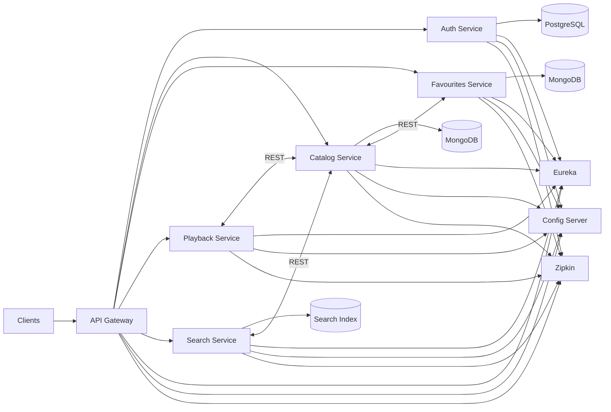

# Streaming Platform

This project is a full-stack streaming platform built with Kotlin Multiplatform for the frontend and Spring Boot microservices architecture for the backend.

---

## Project Status

**Currently in active development**

### Implemented
- Kotlin Multiplatform frontend (Android, TV)
- Angular frontend
- JWT authentication & authorization
- API Gateway
- Eureka Discovery Server
- Spring Cloud Config Server
- Auth microservice
- Catalog microservice
- Favourites microservice
- Playback microservice
- Distributed tracing with Zipkin
- PostgreSQL & MongoDB integration
- Synchronous inter-service communication

### In Progress
- Media playback system
- Streaming session tracking
- Event-driven communication between services
- Resilience and fault-tolerance mechanisms

### Planned
- Kafka integration
- Redis caching
- Horizontal scaling & container orchestration
- Circuit breakers & retry strategies
- Adaptive media streaming

---

## Architecture Diagram

---

## Infrastructure Services

### API Gateway
Single entry point for all client requests.

#### Responsibilities
- Request routing
- JWT validation
- Centralized security layer
- Cross-service communication entry point

---

### Eureka Discovery Server
Dynamic service registration and discovery.

#### Responsibilities
- Service registration
- Instance discovery
- Dynamic routing support

---

### Config Server
Centralized configuration management for all services.

#### Responsibilities
- Shared configuration management
- Environment-specific configuration
- Centralized property handling

---

## Microservices

### Auth Service

Authentication and authorization service built with Spring Security and JWT.

#### Features
- User registration
- User login
- JWT token generation
- JWT validation
- Secure endpoint protection

#### Database
- PostgreSQL

---

### Catalog Service

Handles content discovery.

#### Features
- Content catalog management

#### Database
- MongoDB

---

### Favourites Service

Manages user-specific saved content.

#### Features
- Add/remove favorites
- Personalized user lists
- User-specific content management

#### Database
- Dedicated MongoDB instance

---

## Service Communication

### Current Implementation
- Synchronous HTTP communication between services

### Planned Improvements
- Event-driven asynchronous communication
- Better scalability and resilience

---

## Frontend (Kotlin Multiplatform)

Shared frontend implementation targeting:
- Android
- Android TV
- Web

Planned: 
- iOS with Swift

---

## Screens

- Get Started
- Register
- Login
- Home
- Search
- Details
- Play
- My List
- Profile

---

## Frontend Highlights

- Shared business logic across platforms
- State-driven UI architecture
- Cross-platform code sharing

---

## Media Playback System

Currently in progress

---

## Observability

### Zipkin

Distributed tracing is integrated for:
- Request flow monitoring
- Service-to-service communication tracking
- Distributed debugging
- Performance analysis

---

## Tech Stack

### Frontend
- Kotlin Multiplatform
- Jetpack Compose

Planned:
- SwiftUI iOS client

### Backend
- Spring Boot (Kotlin)
- Spring Security
- Spring Cloud Gateway
- Eureka Discovery Server
- Config Server

### Databases
- PostgreSQL
- MongoDB

### Observability
- Zipkin

---

## Future Improvements

- Kafka messaging
- Redis caching layer
- Circuit breakers and retry strategies
- Horizontal service scaling
- Containerized deployment
- Load balancing across service instances

---

## Architecture Goals

- Scalable distributed system
- Fault-tolerant microservices
- Event-driven architecture
- Horizontal scalability
- Separation of concerns
- Cross-platform client support
- Resilient service communication
